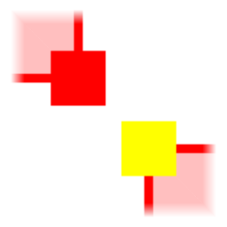
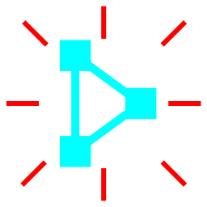

## General

### Brush
A brush is a convex polygonal surfaces. It can have an associated texture which can either be drawn filling its surface or as a sprite. The sprite can be displaced independently of the brush's surface.  
Brushes can also be assigned a path that describes how it moves in the bidimensional space and that can be edited with the Path tool.  
Finally, brushes have a built-in property, `collision`, which determines whether they should represent a clipping surface or not. It can be edited in the properties window.

### Thing
A thing is an object which can be placed around the map. It is characterized by an ID, a width and height, a name, and a texture which represents it.  
Things can also be assigned a path that describes how it moves in the bidimensional space and that can be edited with the Path tool.  
Things can either be defined in one or many .ini files to be placed in the `assets/things/` folder or, if `HillVacuum` is used as a library, adding them to the `hardcoded_things` field of the `HillVacuumPlugin` to insert them in the bevy App.  
If defined in the .ini files, the things must follow a similar format:
```ini
[Name]
width = N
height = M
id = ID
preview = TEX
```
Where `ID` is an unique identifier between 0 and 65534, and `TEX` is the name of the texture (without the file extension) to be drawn along with the bounding box.  
If the texture assigned to the Thing has an animation, the texture will be drawn accordingly.  
  
If a thing in the `HillVacuumPlugin` has the same `ID` as one loaded from file, the latter will overwrite the former.  
Finally, things have two built-in properties, `angle` and `draw height`. The orientation of the arrow drawn on top of the things will change based on the value of `angle`, and `draw height` determines its draw order. They can be edited in the properties window.
  
Things can be reloaded while the application is running through the UI button in the Options menu.

### Properties
Properties are custom user defined values which can be associated to brushes and things.  
Such values can be added to the application through the `brush_properties` and `thing_properties` fields of the `HillVacuumPlugin`.  
Properties can be edited per-entity using the properties window.  
Currently supported value types are `bool`, `u8`, `u16`, `u32`, `u64`, `u128`, `i8`, `i16`, `i32`, `i64`, `i128`, `f32`, `f64`, and `String`.  
  
!!! If a saved map contains properties that differ in type and/or name from the ones defined in the aforementioned resources, a warning window will appear on screen when trying to load the `.hv` file, asking whether you'd like to use the app or map ones.

### Texture
Textures must be placed in the `assets/textures/` folder to be loaded.  
The texture editor can be opened at any time to edit the properties of the textures of the selected brushes.  
Entity, scale, and rotate tool also feature texture editing capabilities. These capabilities can be either enabled through the dedicated "Target" UI element in the bottom left area, or by pressing `Alt + texture editor bind`.  
Textures can have an associated animation which can either consist of a list of textures to display, each one for a specific time, or an atlas of textures generated by subdividing the textures in subareas. The animations can be applied to the texture as a default or to the texture of the selected brushes only.  
When editing a list type animation, it is possible to add a texture by clicking it with the left mouse button.  
To edit the animation of a texture that is not the one of the selected brushes, it needs to be pressed with the right mouse button.  
  
Textures can be reloaded while the application is running through the UI button in the Options menu.  
Default textures animation can be exported and imported between map files. The file extension of the animations files is `.anms`.

### Prop
A prop is a collection of entities which can be painted around the map like the brushes of an image editing tool.  
Each prop has a pivot, the point relative to which it is painted onto the map.  
Props can be imported and exported between map files. The file extension of the props files is `.prps`.

### Path
A path is a series of nodes describing how the entity that owns it moves over time around the map.  
Nodes have five customizable parameters:  
- `Standby`: the amount of time the entity stands still before starting to move to the next node;  
- `Min speed`: the minimum speed the entity moves;  
- `Max speed`: the maximum speed the entity reaches;  
- `Accel (%)`: the percentage of the distance between the current node and the next that the entity will spend accelerating from the minimum to the maximum speed;  
- `Decel (%)`: the percentage of the distance between the current node and the next that the entity will spend decelerating from the maximum to the minimum speed.  

The maximum speed can never be lower than the minimum speed and it can never be 0. The acceleration and deceleration percentages always amount to 100% at most. The acceleration phase always comes before the deceleration one.  
A path can have overlapping nodes. However, two consecutive nodes cannot overlap. Overlapping nodes are clearly shown in the tooltips. Therefore, it is highly encouraged to leave them on.

### Grid
The map grid can be skewed and/or rotated to give the map an isometric look. These two parameters can be edited in the settings window.

### Cursor
A semitransparent square is shown on screen to represent the world position of the cursor. This is useful to show where the camera will zoom in/out when pressing `Ctrl + Mouse wheel`.

### Subtools
Subtools are UI elements that show up on the right when certain tools are selected to provide easy access to functions bound to hardcoded shortcuts.  
Left clicking the first time enables them, clicking a second time disables them.  
Every subtool shows the associated keyboard shortcut in the tooltip.  
Subtools can also be disabled by pressing `Escape`.

### Tab
Whenever a tool allows you to select/deselect entities, `Tab` can be pressed to select the next element beneath it, if any.

### Tools
Tools can be selected by clicking the icons on the left side of the screen or by pressing the bound key.  
Bound keys can be viewed and changed through the bind menu.

&nbsp;

## Edit

### INFO
These commands can only be used while there is no ongoing edit.

### Ctrl + A
Select all, selects all the elements of the category the currently selected tool is capable of editing (entities, vertexes, sides, etc. etc.).

### Ctrl + C
Copy, copies the selected entities, or the path of the entity beneath the cursor, if any, when using the Path tool.

### Ctrl + V
Paste, creates copies of the selected entities, or sets the path of the entity beneath the cursor to the copied one, if any, when using the Path tool.

### Ctrl + C
Copy, copies the selected entities, or the path of the entity beneath the cursor, if any, when using the Path tool.

### Ctrl + D
Duplicate, creates copies of the selected entities and places them one grid square away to the right. Equivalent to `Alt + Right` when using the Entity tool.

### Ctrl + Z
Undo.

### Ctrl + Y
Redo.

&nbsp;

## View

### Space
Drags the camera around.

### Ctrl + Up/Down/Left/Right
Moves the camera one grid square in the pressed direction.

### Ctrl + Plus
Zooms the camera in.

### Ctrl + Minus
Zooms the camera out.

### Mouse wheel
Moves the camera up/down.

### Shift + Mouse wheel
Moves the camera left/right/

### Ctrl + Mouse wheel
Zooms the camera towards/outwards the cursor position.

### Alt + Zoom tool bind
Zooms the camera on the selected entities.

&nbsp;

## Square tool
  

### Left mouse
Spawns a grid square shaped brush.

### Left mouse + cursor drag
Creates a rectangular shaped brush spawned when the mouse button is released.

### Backspace
Deletes all drawn brushes.

&nbsp;

## Triangle tool
  

### Left mouse
Spawns a right triangle with right angle placed at the closest grid lines intersection and legs grid-square-side sized.

### Left mouse + cursor drag
Creates a right triangle shaped brush spawned when the mouse button is released.

### Tab
Changes the orientation of the triangle being drag spawned.

&nbsp;

## Circle tool
  

### Left mouse
Spawns an ellipse shaped brush inscribed in the hovered grid square.

### Left mouse + cursor drag
Spawns an ellipse shaped brush when the mouse button is released.

### Plus
Increases the ellipse resolution.

### Minus
Decreases the ellipse resolution.

&nbsp;

## Free draw tool
  

### Left mouse
Attempts to add a vertex to the shape being drawn. Nothing happens if the shape generated adding such vertex is concave, or the shape already contains that vertex.

### Right mouse
Deletes the vertex beneath the cursor.

### Enter
Attempts to spawn the shape currently being drawn. Nothing happens if the shape is just a point or a line.

### Escape
Erases the brush being drawn.

&nbsp;

## Thing tool
  

### INFO
The pivot determines how the selected things are spawned on the map with respect to the mouse position. For example, if the pivot is set to `TopLeft` the thing is spawned with its top left corner placed at the mouse position.

### Thing change subtool (Alt + Left mouse)  
  

Allows to change the selected things placed on the map to the thing clicked in the UI.

### Left mouse
Spawn the selected thing based on the selected pivot.  
If a thing in the UI gallery at the bottom of the screen is pressed, all drawn things after that will represent that thing.

### Alt + Left mouse
If a thing in the UI gallery at the bottom of the screen is pressed, all selected and drawn things are changed to be that thing.

### Tab
Sets the pivot to the next possible value. If `Alt` is pressed as well it is set to the previous value.

### Backspace
Deletes all drawn things.

&nbsp;

## Entity tool
  

### INFO
Brushes can be tied together into a group through the `Right mouse`. This establishes a owner-attached relation between the brushes. An "owner" brush can have an unlimited amount of brushes tied to it. A brush that is attached can have none.  

### Drag spawn subtool (Alt + directional key or cursor drag)  
  

Selecting it and then pressing a directional key, or left clicking and dragging with the cursor a selected brush, spawns copies of the selected entities in the desired direction.

### Left mouse
If there is a non-selected entity beneath the cursor, it is exclusively selected. If there is no entity, all entities are deselected when the mouse button is released.  
Clicking brush while holding `Ctrl` causes all attached brushes to be selected as well.

### Shift + Left mouse
If there is an entity beneath the cursor, its selection status is toggled.  
Pressing `Ctrl` on a brush causes all attached brushes to be toggled as well.

### Left mouse + cursor drag
If there is a selected entity beneath the cursor, all selected entities are dragged around the map. If there is no entity, a rectangular selection is initiated.  
When the mouse button is released, the entities within the rectangular selection area are exclusively selected.  
Pressing `Ctrl` all attached brushes are selected as well.

### Shift + Left mouse + cursor drag
Same as `Left mouse + drag`, except the entities within the boundary of the rectangular selection are added to the selected brushes, if they are not already selected.  
Pressing `Ctrl` all attached brushes are selected as well.

### Up/Down/Left/Right
Moves the selected entities one grid square away in the pressed direction.

### Backspace
Deletes the selected entities, or the textures of the selected brushes if the editing target is set to `Texture`.

### Right mouse
Clicking a brush with no path and not attached, allows to attach it to another brush by then clicking the latter. Clicking on an attached brush detaches it.

### TEXTURE EDITING
Target:  
- `Entity`, only moves entities;  
- `Entity+Tex`, moves both entities and textures;  
- `Texture`, only moves textures.

&nbsp;

## Vertex tool
  

### Vertex insertion subtool (Alt + Left mouse)  
  

Selecting it and then left clicking on the side of a selected brush inserts a new vertex on the line that passes through the cursor position. Such vertex can then be dragged around as long as it does not cause the resulting shape to be concave.

### Vertexes merge subtool (Alt + Merge tool bind)  
  

Generates a new brush from the selected vertexes, if there are more than 3.

### Vertexes split subtool (Enter)  
  

If there are only two selected vertexes on each selected brush that has selected vertexes, splits them in two using the line passing through the vertexes as clip line.  
It fails if at least one brush is a triangle or the selected vertexes are consecutive.

### Polygon to path subtool (Alt + Left mouse)  
  

After being enabled, vertexes of the selected brushes can be clicked in sequence with the `Left mouse`  to create a path which can then be assigned to an entity by pressing `Enter`.

### Left mouse
If there is a non-selected vertex beneath the cursor, it is exclusively selected. If there is no vertex underneath, when the mouse button is released all selected vertexes are deselected.

### Shift + Left mouse
If there is a vertex beneath the cursor, its selection status is toggled.

### Left mouse + cursor drag
If there is a selected vertex beneath the cursor, all selected vertexes are dragged around the map. Unless the move generates at least one illegally shaped brush. If a moved vertex overlaps a non selected one, this vertex is selected as well.  
If there is no vertex, a rectangular selection is initiated. When the mouse button is released, the vertexes within the rectangular selection area are exclusively selected.

### Shift + Left mouse + cursor drag
Same as `Left mouse + cursor drag`, except the vertexes within the boundary of the rectangular selection are added to the selected brushes if they are not already selected.

### Up/Down/Left/Right
Moves the selected vertexes one grid square away in the pressed direction, unless the move generates at least one illegally shaped brush.  
If a moved vertex overlaps a non selected one, it is selected as well.

### Backspace
Deletes all selected vertexes, unless there is at least one brush that would become a point or line, or be erased, if such vertexes were deleted.

&nbsp;

## Side tool
  

### Side xtrusion subtool (Alt + Left mouse + cursor drag)  
  

Selecting it and then left clicking on a selected side of starts the xtrusion process.
If the cursor is moved away from the brush, the side is extruded, generating a new brush. Otherwise the brush is split in two by a line with the same slope as the selected side.  
Both extrusion and intrusion can be executed on multiple selected sides, as long as they all have the same slope.

### Sides merge subtool (Alt + Merge tool bind)  
  

Generates a new brush from the selected sides, if there are more than 2.

### Left mouse
If there is a non-selected side beneath the cursor, it is exclusively selected. If there is no side underneath, when the mouse button is released, all selected sides they are deselected.

### Shift + Left mouse
If there is a selected side beneath the cursor, its selection status is toggled.

### Left mouse + cursor drag
If there is a selected side beneath the cursor, all selected sides are dragged around the map. Unless the move generates at least one illegally shaped brush. If there is no side, a rectangular selection is initiated.  
When the mouse button is released, the sides within the rectangular selection area are exclusively selected.  
If a moved side overlaps a non selected one, this side is selected as well.

### Shift + Left mouse + cursor drag
Same as `Left mouse + cursor drag`, except the sides within the boundary of the rectangular selection are added to the selected brushes if they are not already selected.

### Up/Down/Left/Right
Moves the selected sides one grid square away in the pressed direction, unless the move generates at least one illegally shaped brush.  
If a moved side overlaps a non selected one, this side is selected as well.

### Backspace
Deletes all selected sides, unless there is at least one brush that would become a point or line if such sides were deleted.

&nbsp;

## Snap tool
  

### Snap Tool key
Based on the active tool the following are snapped to the grid:
- `Entity tool`: selected entities;  
- `Thing tool`: selected things;  
- `Vertex Tool`: selected vertexes;  
- `Side Tool`: selected sides;  
- any other tool: selected brushes.

### Alt + Snap Tool key
Quick snap: snaps the entities to a two-units size grid.

&nbsp;

## Clip tool
  

### Side clip subtool (Alt + Left mouse)  
  

After selecting it, if there is a side of a selected brush beneath the cursor all brushes are clipped by the line passing through the vertexes of such side. Can only be enabled when there are two or more selected brushes.

### Left mouse
Places the points through which the clipping line passes.

### Tab
Changes the brushes that are spawned after the clip has been executed.  
By default, both brushes on the right and left of the clip line are spawned, but this can be changed to just the left or right ones. If `Alt` is pressed as well the brushes are cycled in the opposite order.

### Enter
Confirms the clip.

&nbsp;

## Shatter tool
  

### Left mouse
Shatters the highlighted selected brush beneath the cursor into triangles which have a common vertex in the cursor position.  
The common vertex can be a vertex of the original brush, a point on a side, or a point inside the brush's area.

&nbsp;

## Hollow tool
  

### Hollow Tool key
Creates rooms out of the selected brushes with walls that are as thick as the grid size. Does nothing if there is at least one selected brush which cannot be properly hollowed.

&nbsp;

## Scale tool
  

### Left mouse + cursor drag
Clicking a corner of the outline encompassing all selected brushes and dragging it scales the selected brushes.  
The scale does not occur if the moved corner would overlap a nearby one.

### Up/Down/Left/Right
Scales the selected brushes in the pressed direction by one grid square.

### Tab
Changes the outline's selected vertex. The selection order is clockwise. If `Alt` is pressed as well the vertexes are cycled counter-clockwise.

### TEXTURE EDITING
Target:  
- `Entity`, only scales the polygons;  
- `Entity+Tex`, scales both polygons and textures;  
- `Texture`, only scales the textures.

&nbsp;

## Shear tool
  

### Left mouse + cursor drag
Clicking a side of the outline encompassing all selected brushes and dragging it shears the selected brushes.

### Up/Down/Left/Right
Shears the selected brushes in the pressed direction by one grid square.

### Tab
Changes the outline's selected side. The selection order is clockwise. If `Alt` is pressed as well the sides are cycled in reverse order.

&nbsp;

## Rotate tool
  

### Pivot subtool (Alt + directional key or cursor drag)  
  

While enabled, the position of the rotation pivot can be changed by either pressing the directional keys or clicking with `Left mouse`.

### Left mouse + cursor drag
Rotates the selected brushes around the pivot by the selected angle snap.

### Left/Right
Rotates the selected brush in clockwise (`Right`) or counterclokwise (`Left`) direction by the set angle.

### TEXTURE EDITING
Target:  
- `Entity`, rotates only the polygons;  
- `Entity+Tex`, rotates both polygons and textures;  
- `Texture`, rotates only the textures.

&nbsp;

## Flip tool
  

### Up/Down/Left/Right
Creates mirrored copies of the selected brushes in the pressed direction.

### TEXTURE EDITING
Target:  
- `Entity`, only flips the polygons;  
- `Entity+Tex`, flips both polygons and textures;  
- `Texture`, only flips the textures.

&nbsp;

## Intersection tool
  

### Intersection Tool key
Generates the intersection brush of the selected brushes. If not all selected brushes overlap over a common area they are erased from the map.

&nbsp;

## Merge tool
  

### Merge Tool key
Merges all the vertexes of the selected brushes into one convex encompassing brush. The selected brushes are then erased.

&nbsp;

## Subtract tool
  

### Left mouse
If there is a non-selected entity beneath the cursor, it is exclusively selected. If there is no entity, all entities are deselected when the mouse button is released.

### Shift + Left mouse
If there is an entity beneath the cursor, its selection status is toggled.

### Left mouse + cursor drag
If there is no entity beneath the cursor, a rectangular selection is initiated. When the mouse button is released, the entities within the rectangular selection area are exclusively selected.

### Shift + Left mouse + cursor drag
Same as `Left mouse + drag`, except the entities within the boundary of the rectangular selection are added to the selected brushes, if they are not already selected.  

### Enter
Executes the subtraction.

&nbsp;

## Paint tool
  

### INFO
When created, the props can be stored in slots displayed in the UI gallery at the bottom of the screen (such gallery is not shown if there are no stored props).  
Props can either be stored in a numbered slot by specifying its number in the window that pops up during the prop creation process, or in the quick slot by not typing any number. Only one prop can be placed in the quick slot.

### Prop creation subtool (Enter)  
  

Initiates the prop creation process. A prop is generated from the selected entities, and after a pivot is chosen by clicking with the `Left mouse` within the borders of the outline, it can be stored in the specified slot and later be painted around the map after being selected.  
If no slot number is specified the prop is stored in a temporary slot.

### Quick prop subtool (Alt + Left mouse + cursor drag)  
  

Paints the prop stored in the quick slot, if any. After the `Left mouse` is released it is automatically deselected.

### Left mouse
Paints the prop in the selected slot, if any, so that its pivot coincide with the cursor position.  
If a prop in the UI gallery at the bottom of the screen is clicked, it is selected as the prop to be painted.

### Left mouse + cursor drag
Paints the prop in the selected slot around the map.

### Backspace
Removes the prop in the selected slot.

&nbsp;

## Path tool
  

### INFO
When enabled, the entities are split in three groups:  
- entities that have a path and are selected, and the brushes attached to them;  
- entities that are selected, but do not have a path and are not attached to another brush. Therefore they are entities which can have a path;  
- all other cases, entities that are not selected and/or cannot have a path.

### Path free draw subtool (Alt + Left mouse)  
  

Selecting it and then clicking an entity that can have a path enables the path creation. Nodes can be added by pressing the `Left mouse` and can be removed by pressing the `Right mouse`. `Enter` concludes the process.

### Insert node subtool (Alt + Left mouse)  
  

After selecting it, if a node is clicked, it inserts a new node in the path of the clicked node, after such node. The node can then be dragged around as long as it does not cause the resulting path to have consecutive overlapping nodes.

### Movement simulation subtool (Enter)  
  

Selecting it starts the movement simulation. The selected entities with a path are moved around the map according to their parameters. Pressing `Enter` a second time pauses the simulation and pressing `Esc` concludes it.

### Left mouse
If a non-selected node is clicked, it is exclusively selected.

### Shift + Left mouse
Clicking a node toggles its selection status.

### Left mouse + cursor drag
If a selected node is clicked, all selected nodes are dragged. Otherwise, a rectangular selection is initiated. When the mouse button is released, all nodes within the boundaries of the outline are exclusively selected.

### Shift + Left mouse + cursor drag
Same as `Left mouse + cursor_drag`, except the nodes within the boundary of the rectangular selection are added to the selected brushes if they are not already selected.

### Backspace
Deletes all selected nodes, unless doing so would generate a path with a single node or a path with consecutive overlapping nodes.

### Alt + backspace
Deletes the paths of the selected entities.

### Up/Down/Left/Right
Moves all selected nodes a grid square away in the pressed direction.

&nbsp;

## Zoom tool
  

### Left mouse + cursor drag
Creates a rectangular selection that determines the area onto which the viewport is zoomed. Zoom is actuated once the Left mouse button is released.

&nbsp;

